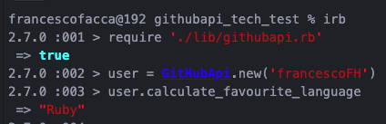
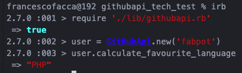

# GitHub API

Github API is a command line application, which allow users to enter an arbitrary Github username, and be presented with a best guess of the Github user's favourite programming language.

This has be computed by using the Github API to fetch all of the user's public Github repos, each of which includes the name of the dominant language for the repository.

Documentation for the Github API can be found at https://developer.github.com/v3/

### How to Run the App
```
$ git clone https://github.com/francescoFH/GitHub-API
$ bundle install
$ irb
  > require './lib/githubapi.rb'
  > user = GitHubApi.new('francescoFH')
  > user.calculate_favourite_language
  => "Ruby"
```



### To Test the App
```
$ rspec
```

Approach
---
